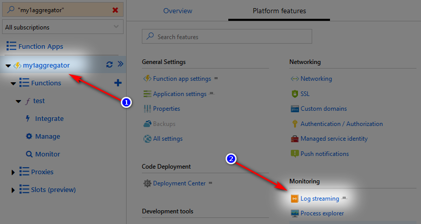

# Build

Building locally requires
- Visual Studio 2019
- Azure Functions and Web Jobs Tools


# Debug


## Custom/development Aggregator runtime

In Visual Studio, `src\aggregator-function\Directory.Build.targets` will automatically package and copy the runtime needed by CLI.
You might have to change the version number in `src\aggregator-function\aggregator-manifest.ini` to force your local version.

You can also use the *Pack* right-click command on the `aggregator-function` project and make sure to copy the created zip into your CLI directory so it uploads the correct one when creating an instance.


## CLI

Set `aggregator-cli` as Start-up project
Use the Visual Studio Project properties to set the Command line arguments.


## Debug Aggregator Runtime (locally)

Open **aggregator-cli.sln** in Visual Studio.  
Set `aggregator-function` as the Start-up project.  
Start the project in Debug mode (hit F5).  
Create a folder with the same name as the rule, e.g. `test1`.  
Add to the folder a file with the same name and suffix `.rule`, `test1.rule` in this example, with the code you want to test, e.g.

```csharp
$"Hello { self.WorkItemType } #{ self.Id } - { self.Title }!"
```

Add to the folder a file named `function.json` with this
```json
{
  "bindings": [
    {
      "type": "httpTrigger",
      "direction": "in",
      "webHookType": "genericJson",
      "name": "req"
    },
    {
      "type": "http",
      "direction": "out",
      "name": "res"
    }
  ],
  "disabled": false
}
```

Add to the folder a file named `run.csx` with this content:
```csharp
#r "../bin/aggregator-function.dll"
#r "../bin/aggregator-shared.dll"

using aggregator;

public static async Task<object> Run(HttpRequestMessage req, ILogger logger, ExecutionContext context)
{
    var handler = new AzureFunctionHandler(logger, context);
    return await handler.Run(req);
}
```

Set a breakpoint.  
Send the request message at http://localhost:7071/api/test1 using [Postman](https://www.getpostman.com) or similar tool.

The Function should log a similar sequence of trace messages.

```
[2019-08-19 12:07:04] Initial WorkItem 12345 retrieved from https://dev.azure.com/mytestorg/56789abc-def0-1234-5678-9abcdef01234
[2019-08-19 12:07:04] Executing Rule...
[2019-08-19 12:07:06] Rule succeeded with Hello Hazard #12345 - My test Work Item!
[2019-08-19 12:07:06] No changes saved to Azure DevOps.
[2019-08-19 12:07:06] execResult Hello Hazard #12345 - My test Work Item!
[2019-08-19 12:07:06] Returning 'Hello Hazard #12345 - My test Work Item!' from 'test1'
[2019-08-19 12:07:06] Executed 'Functions.test1' (Succeeded, Id=890abcde-f123-4567-890a-bcdef0123456)
[2019-08-19 12:07:06] Executed HTTP request: {
[2019-08-19 12:07:06]   "requestId": "f0123456-789a-bcde-f012-3456789abcde",
[2019-08-19 12:07:06]   "method": "POST",
[2019-08-19 12:07:06]   "uri": "/api/test1",
[2019-08-19 12:07:06]   "identities": [
[2019-08-19 12:07:06]     {
[2019-08-19 12:07:06]       "type": "WebJobsAuthLevel",
[2019-08-19 12:07:06]       "level": "Admin"
[2019-08-19 12:07:06]     }
[2019-08-19 12:07:06]   ],
[2019-08-19 12:07:06]   "status": 200,
[2019-08-19 12:07:06]   "duration": 2531
[2019-08-19 12:07:06] }
```

## Debug Aggregator Runtime (live Azure Function)


### View live Aggregator log messages

In Azure Portal, open the Resource Group hosting the Instance (`aggregator-` followed by name of instance).
Open the App Service hosting the Instance (instance name followed by `aggregator`).
Switch to the **Platform features** tab and click on _Log streaming_ like in the picture.



# Integration tests

Integration tests emulate a user running Aggregator CLI.

These tests require configuration data in `src/integrationtests-cli/logon-data.json` to connect to Azure and Azure DevOps and run the tests.
```
{
	"subscription": "PUT-AZURE-SUBSCRIPTION-GUID-HERE",
	"client": "PUT-AZURE-SERVICE-PRINCIPAL-GUID-HERE",
	"password": "PUT-AZURE-SERVICE-PRINCIPAL-PASSWORD-HERE",
	"tenant": "PUT-AZURE-TENANT-GUID-HERE",
	"devopsUrl": "https://dev.azure.com/PUT-AZUREDEVOPS-ORGANIZATION-NAME-HERE",
	"pat": "PUT-AZUREDEVOPS-PAT-HERE",
	"location": "PUT-AZURE-REGION-NAME-HERE",
	"resourceGroup": "PUT-AZURE-RESOURCE-GROUP-NAME-HERE",
	"projectName": "PUT-AZUREDEVOPS-PROJECT-NAME-HERE"
}
```

To avoid committing this file in Git, use `git update-index --assume-unchanged src/integrationtests-cli/logon-data.json` and edit the file content 
