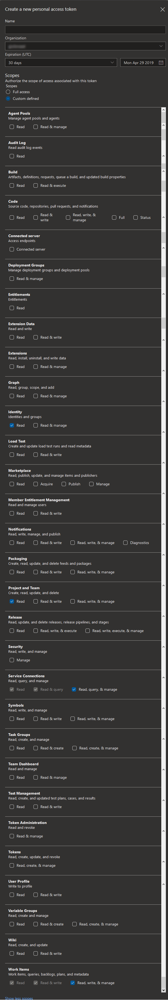
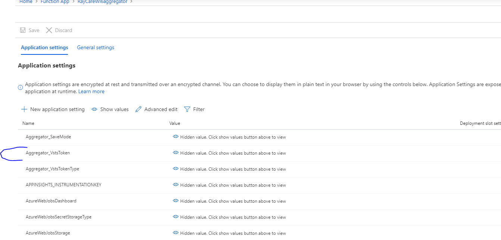

# Setup for Aggregator CLI


## Prerequisites

We developed and tested Aggregator on Windows 10 and presumably it works fine on Windows Server 2019. If you find that works on different operating systems, let us know.

To use Aggregator you need three things:
- Access to an Azure Subscription
- Access to an Azure DevOps Organization
- [.Net Core 3.1](https://dotnet.microsoft.com/download/dotnet-core/3.1) installed on the machine where you run Aggregator CLI

Aggregator uses a Service Principal (SP) to interact with Azure. For testing you can grant the SP powerful permissions; in a production scenario, is more typical to create one or more Azure Resource Groups and grant the SP permission to those.
In addition Aggregator uses an Azure DevOps Personal Access Token (PAT) to create the event subscriptions and interact with object in the target Azure DevOps Project.


## How to create an Azure Service Principal

If you do not have Contributor or Owner permission to the Azure Subscription, ask your administrator to do the instructions that follow.

To create an Azure Service Principal you can [use Azure Powershell](https://docs.microsoft.com/en-us/powershell/azure/create-azure-service-principal-azureps?view=azps-2.4.0) or [Azure CLI](https://docs.microsoft.com/en-us/cli/azure/create-an-azure-service-principal-azure-cli?view=azure-cli-latest).
Shortly, run this Azure CLI command:

```bash
az ad sp create-for-rbac --name AggregatorServicePrincipal
```

when successful, it outputs something similar

```
{
  "appId": "12345678-90ab-cdef-1234-567890abcedf",
  "displayName": "AggregatorServicePrincipal",
  "name": "http://AggregatorServicePrincipal",
  "password": "23456789-0abc-def1-2345-67890abcdef1",
  "tenant": "34567890-abcd-ef12-3456-7890abcedf12"
}
```
take note of this information and keep it in a safe place. If you prefer a different password you can force a new one with a similar command:

```bash
az ad app credential reset --id 12345678-90ab-cdef-1234-567890abcedf --append --password P@ssw0rd!
```


### Assign permissions to Service Principal

The Service Principal must have Contributor permission to the Azure Subscription or, in alternative, pre-create the Resource Group in Azure and give the service account Contributor permission to the Resource Group.


This example creates a Resource Group and gives permission to the Service Principal created in the previous example.

```bash
# create Resource Group with permission to Service Principal
az group create --name aggregator-cli-demo --location westeurope
az role assignment create --role Contributor --assignee 12345678-90ab-cdef-1234-567890abcedf --resource-group aggregator-cli-demo
```

In Azure Portal you can check the permissons in the IAM menu for the selected Resource Group


## Azure DevOps Personal Access Token (PAT)

A PAT has the same or less permissions than the person/identity that creates it.
We recommend that the PAT is issued by an Azure DevOps Organization Administrator Identity.

When using the [impersonate directive](rule-language.md#impersonate-directive), 
[mapping a rule](command-examples.md#adds-two-service-hooks-to-azure-devops--each-invoking-a-different-rule)
to execute impersonated or 
[configuring a rule impersonated](command-examples.md#),
the used identity for creating the PAT must have the permission: 
"Bypass rules on work item updates"

Aggregator needs the following Scopes:

- Identity: Read
- Project & Team: Read
- Service connections: Read, query & manage
- Work Items: Read, write & manage



Careful with the Expiration: Aggregator stores the PAT in the Azure Function configuration, allowing the rules to access Azure DevOps. You should refresh the PAT before expires or save a new PAT in Aggregator configuration using the `configure.instance` command.




## Get the executable

Finally to run Aggregator CLI, download the latest `CLI.zip` file from GitHub [Releases](https://github.com/tfsaggregator/aggregator-cli/releases) and unzip it in a convenient location.

